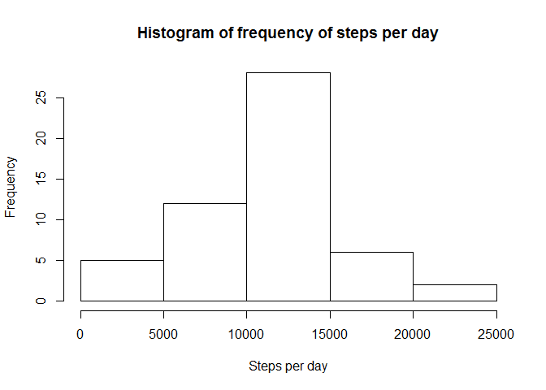
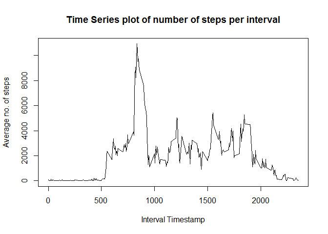
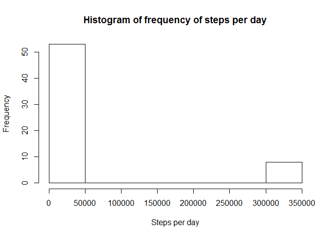
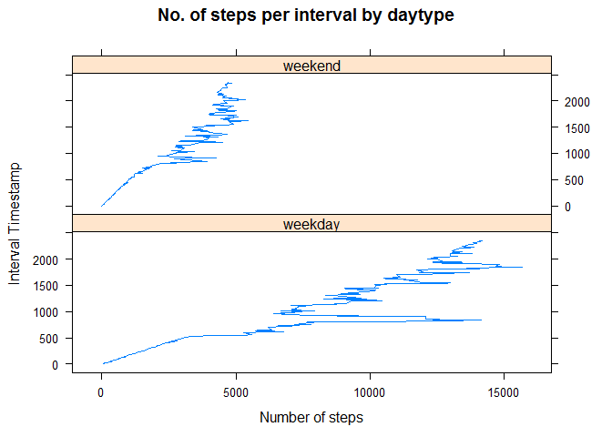

# Reproducible Research: Peer Assessment 1


## Loading and preprocessing the data
1. Load the data

```r
rawData <- read.csv("activity.csv", stringsAsFactors = FALSE);
```

2. Process/transform the data (if necessary) into a format suitable for the analysis.  
Convert the date column into a POSIXct format.

```r
rawData$date <- as.POSIXct( strptime(rawData$date, "%Y-%m-%d"));
```


## What is mean total number of steps taken per day?

```r
library(dplyr)
```

```
## 
## Attaching package: 'dplyr'
## 
## The following objects are masked from 'package:stats':
## 
##     filter, lag
## 
## The following objects are masked from 'package:base':
## 
##     intersect, setdiff, setequal, union
```

```r
dayWiseData <- rawData %>% filter(!is.na(steps)) %>% group_by(date) %>% summarise(steps = sum(steps))
hist(dayWiseData$steps, xlab="Steps per day", main="Histogram of frequency of steps per day");
```

 

```r
dailyMean = mean(dayWiseData$steps)
dailyMedian = median(dayWiseData$steps)
print(dailyMean)
```

```
## [1] 10766.19
```

```r
print(dailyMedian)
```

```
## [1] 10765
```

Mean of the total number of steps taken per day: **1.0766189\times 10^{4}**  
Median of the total number of steps taken per day: **10765**

## What is the average daily activity pattern?


```r
intervalData <- rawData %>% filter(!is.na(steps)) %>% group_by(interval) %>% summarise(steps = sum(steps))
plot(intervalData$interval, intervalData$steps, type="l", xlab="Interval Timestamp", ylab="Average no. of steps", main="Time Series plot of number of steps per interval")
```

 

```r
maxInterval <- intervalData$interval[which.max(intervalData$steps)]
```
Interval with the maximum average number of steps: **835**

## Imputing missing values

```r
rowsWithNA <- sum(is.na(rawData$steps))
```
Total rows with NA: **2304**  
To fill the missing values, I take the **mean value of the same interval timestamp from the original dataset and assign it to the missing row in the new dataset**.

```r
meandata <- rawData %>% filter(!is.na(steps)) %>% group_by(interval) %>% summarise(steps = as.integer(mean(steps)))
naRemovedData <- rawData
for(i in 1:nrow(naRemovedData))
{
  r <- naRemovedData[i,]
  if(is.na(r$steps))
    naRemovedData[i,1] <- meandata[which(meandata$interval==r$interval) ,1]
}
print(sum(is.na(naRemovedData$steps)))
```

```
## [1] 0
```

```r
dayWiseDataNoNA <- naRemovedData %>% group_by(date) %>% summarise(steps = sum(steps))
hist(dayWiseDataNoNA$steps, xlab="Steps per day", main="Histogram of frequency of steps per day");
```

 

```r
dailyMeanNoNA = mean(dayWiseDataNoNA$steps)
dailyMedianNoNA = median(dayWiseDataNoNA$steps)
print(dailyMeanNoNA)
```

```
## [1] 53828.98
```

```r
print(dailyMedianNoNA)
```

```
## [1] 11458
```

Mean of the total number of steps taken per day: **5.3828984\times 10^{4}**  
Median of the total number of steps taken per day: **11458**

As evident from the difference in mean/ median and histogram charts of the different data, after inputting missing values, depending upon the mechanism of inputting the data, the results have changed drastically.
In, this case, as a result of taking the average of interval data as missing values, **the variation in data has disappeared.**  
Original mean being **1.0766189\times 10^{4}** and new mean being **5.3828984\times 10^{4}**  
whereas median relatively less affected with  
Original median being **10765** and new median being **11458**  

## Are there differences in activity patterns between weekdays and weekends?

```r
weekdayLabels <- c('Monday', 'Tuesday', 'Wednesday', 'Thursday', 'Friday')
naRemovedData <- mutate(naRemovedData, dayType =c('weekend', 'weekday')[(weekdays(date) %in% weekdayLabels)+1L])
IntervalAvgByDayType <- naRemovedData %>% group_by(dayType,interval) %>% summarise(steps = sum(steps))
library(lattice)
xyplot(IntervalAvgByDayType$interval~IntervalAvgByDayType$steps|IntervalAvgByDayType$dayType, type="l", layout=c(1,2), main="No. of steps per interval by daytype", xlab="Number of steps", ylab="Interval Timestamp")
```

 
  
  The above plot shows the differences in activity patterns between weekdays and weekends.
